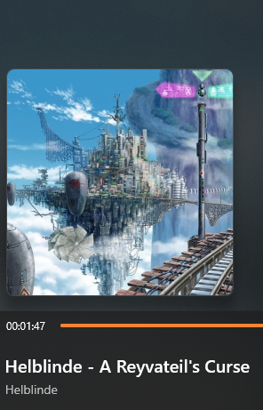

# yt-dlp Configs
My yt-dlp setup for downloading YouTube playlists and music

## Shell Commands
The following commands are plain shell commands. If under Linux, make sure to first install all dependencies like [ffmpeg](https://www.ffmpeg.org/), [mutagen](https://github.com/quodlibet/mutagen) and so on.
### Downloads all playlists of a channel, and then the remaining videos of the channel that were not in any playlist
```
yt-dlp /Channel/Playlists-Link /Channel/-Link -o "%(playlist_title)s/%(playlist_index)s - %(title)s [%(id)s].%(ext)s" --download-archive archive.txt --embed-thumbnail --embed-metadata
```

### Crops the thumbnail to be quatratic and embeds it into the mp3 file
```
yt-dlp LINK -f bestaudio -x --audio-format mp3 --convert-thumbnail png --add-metadata --embed-thumbnail --ignore-config --audio-quality 0 --ppa "ffmpeg: -c:v mjpeg -vf crop=\"'if(gt(ih,iw),iw,ih)':'if(gt(iw,ih),ih,iw)'\""
```

<p align="center">
  
</p>

### Find out the IDs of non available YouTube Videos
This Command appends the IDs of not available YouTube-Videos to nichtverfuegbar.txt. Run this command after downloading your playlist with `--download-archive` at least once.
If you want to seperate the individual runs, run first:
```
echo ********************* >> nichtverfuegbar.txt
```
Then run the following command:
```
yt-dlp --get-id --download-archive archiv.txt --flat-playlist --ignore-config --cookies-from-browser chrome LINK >> nichtverfuegbar.txt
```
